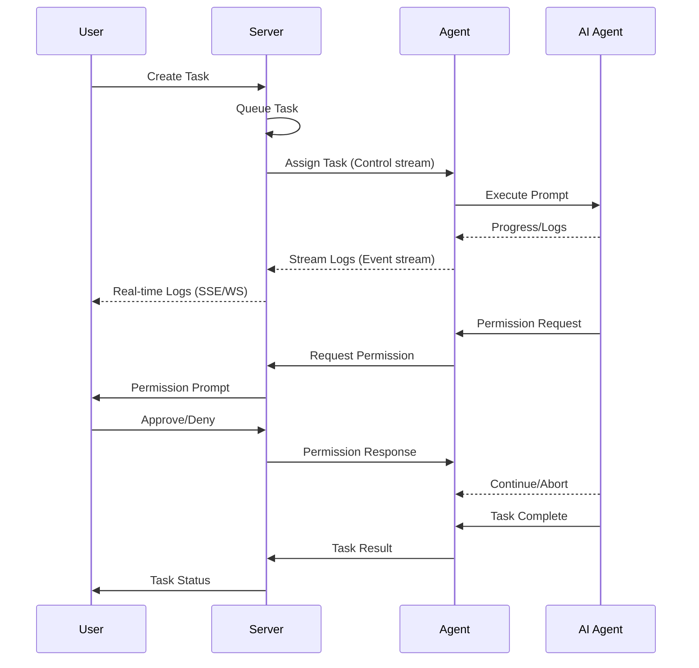

# Architecture

Marionette is designed as a modular, scalable platform for orchestrating AI coding agents.

## System Overview

```
┌─────────────────────────────────────────────────────────────────────────────┐
│                              Server (Go)                                    │
│  ┌────────────────────────────────────────────────────────────────────┐     │
│  │                            Core                                    │     │
│  │  ┌────────────┐ ┌────────────┐ ┌────────────┐ ┌────────────┐       │     │
│  │  │ SessionMgr │ │  TaskMgr   │ │ RunnerMgr  │ │ TunnelMgr  │       │     │
│  │  └────────────┘ └────────────┘ └────────────┘ └────────────┘       │     │
│  │  ┌────────────┐ ┌────────────┐ ┌────────────┐                      │     │
│  │  │ ProviderMgr│ │WorkspaceMgr│ │ SandboxMgr │                      │     │
│  │  └─────┬──────┘ └─────┬──────┘ └────────────┘                      │     │
│  └────────┼──────────────┼────────────────────────────────────────────┘     │
│           │              │                                                  │
│  ┌────────▼──────────────▼────────────────────────────────────────────┐     │
│  │                    Provider Registry                               │     │
│  │  ┌────────┐ ┌────────────┐ ┌─────┐ ┌───────────┐ ┌──────┐          │     │
│  │  │ Docker │ │ Kubernetes │ │ E2B │ │Firecracker│ │ Pool │          │     │
│  │  └────────┘ └────────────┘ └─────┘ └───────────┘ └──────┘          │     │
│  └────────────────────────────────────────────────────────────────────┘     │
│           │                                                                 │
│  ┌────────▼───────────────────────────────────────────────────────────┐     │
│  │  :9090 gRPC   |<---- marionette-agent (mTLS)                       │     │
│  │  :8080 Public |<---- CLI / External Apps (API Key)                 │     │
│  │  :8081 Admin  |<---- Admin WebUI (Basic Auth)                      │     │
│  └────────────────────────────────────────────────────────────────────┘     │
│           │                                                                 │
│  ┌────────▼──────┐                                                          │
│  │    Store      │                                                          │
│  │  PostgreSQL   │                                                          │
│  └───────────────┘                                                          │
└─────────────────────────────────────────────────────────────────────────────┘
```

## Components

### Server

The central component that manages all orchestration:

| Component | Responsibility |
|-----------|----------------|
| **SessionMgr** | Session lifecycle (create, suspend, resume, terminate) |
| **TaskMgr** | Task execution and retry logic |
| **RunnerMgr** | Runner registration and health monitoring |
| **TunnelMgr** | Port forwarding and streaming |
| **ProviderMgr** | Provider registration and runner spawning |
| **WorkspaceMgr** | Workspace storage and synchronization |

### Agent (marionette-agent)

Runs inside each Runner and:

- Connects to the server via gRPC
- Manages the AI coding agent (Claude Code, Codex, etc.)
- Executes tasks in sandboxed environments
- Streams logs and handles permission requests

### CLI (mctl)

Command-line interface for:

- Session and task management
- Runner monitoring
- Permission handling
- Admin operations

## Communication

### Protocols

| Connection | Protocol | Authentication |
|------------|----------|----------------|
| Agent ↔ Server | gRPC (bidirectional streaming) | mTLS / Runner Token |
| CLI ↔ Server | REST/HTTP | API Key |
| Admin ↔ Server | REST/HTTP | Basic Auth / Master Key |
| Browser ↔ Server | WebSocket / SSE | API Key / Tunnel Token |

### Agent Connection Model

Agents **initiate** connections to the server (not the reverse):

```
┌──────────────────┐                    ┌──────────────────┐
│      Agent       │                    │      Server      │
│                  │                    │                  │
│  ┌────────────┐  │     Connect()      │  ┌────────────┐  │
│  │ gRPC Client├──┼───────────────────►│  │ gRPC Server│  │
│  └────────────┘  │                    │  └────────────┘  │
│                  │◄─── Control ───────│                  │
│                  │     (tasks)        │                  │
│                  │                    │                  │
│                  │──── Events ───────►│                  │
│                  │     (logs, perms)  │                  │
└──────────────────┘                    └──────────────────┘
```

This design:

- Avoids firewall issues (like GitHub Actions runners)
- Enables agents behind NAT
- Simplifies deployment

## Data Flow

### Task Execution



## Storage Architecture

### Database (PostgreSQL)

Stores all persistent state:

- Sessions, tasks, runs
- Runner registrations
- Workspace metadata
- API keys and tokens
- Audit logs

### Object Storage

For large data:

- Workspace snapshots (CAS chunks)
- Log archives
- Agent context snapshots

See [Storage](../reference/storage.md) for details on content-addressable storage.

## Security Model

### Multi-Tenant Isolation

- All resources are scoped by `tenant_id`
- Injected by auth middleware (never from user input)
- Cross-tenant access prevented at application layer

### Credential Handling

| Mode | Storage | Use Case |
|------|---------|----------|
| **Managed** | Encrypted in DB | Operator provides keys |
| **BYOK** | Memory only | Users bring own keys |

### Transport Security

- **Production**: mTLS required for agent connections
- **Development**: TLS can be disabled with `skip_tls: true`

## Scalability

### Horizontal Scaling

- **Server**: Stateless, can run multiple replicas
- **Agents**: Scale independently per provider
- **Database**: PostgreSQL with read replicas

### High Availability

```
┌─────────────────────────────────────────────────────────┐
│                    Load Balancer                        │
└─────────────────────────┬───────────────────────────────┘
                          │
        ┌─────────────────┼─────────────────┐
        │                 │                 │
        ▼                 ▼                 ▼
┌───────────────┐ ┌───────────────┐ ┌───────────────┐
│   Server 1    │ │   Server 2    │ │   Server 3    │
└───────┬───────┘ └───────┬───────┘ └───────┬───────┘
        │                 │                 │
        └─────────────────┼─────────────────┘
                          │
                          ▼
                ┌─────────────────┐
                │   PostgreSQL    │
                │   (Primary)     │
                └────────┬────────┘
                         │
              ┌──────────┴──────────┐
              ▼                     ▼
      ┌─────────────┐       ┌─────────────┐
      │   Replica   │       │   Replica   │
      └─────────────┘       └─────────────┘
```

## Next Steps

- [Sessions & Tasks](sessions-tasks.md) - Understand the execution model
- [Providers](providers.md) - Learn about different provider types
- [Workspaces](workspaces.md) - Workspace persistence and sync
