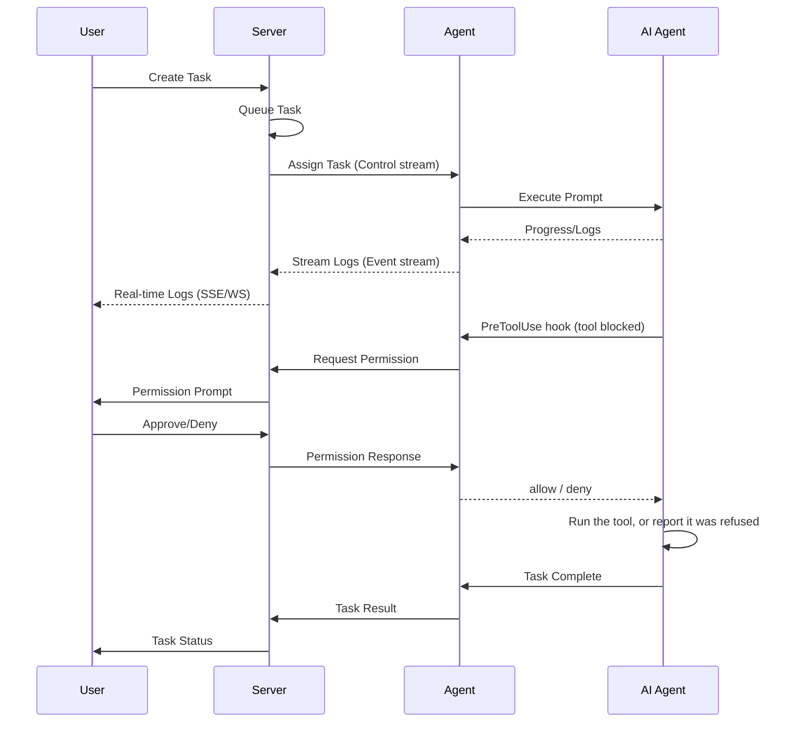

# Architecture

Marionette is designed as a modular, scalable platform for orchestrating AI coding agents.

## System Overview

=== "Diagram"

    ```mermaid
    flowchart TB
        subgraph Server["Server (Go)"]
            subgraph Core["Core Services"]
                SM[SessionMgr]
                TM[TaskMgr]
                RM[RunnerMgr]
                TuM[TunnelMgr]
                PM[ProviderMgr]
                WM[WorkspaceMgr]
                SaM[SandboxMgr]
            end

            subgraph Providers["Provider Registry"]
                Docker
                K8s[Kubernetes]
                E2B
                FC[Firecracker]
                Pool
            end

            Core --> Providers

            subgraph Endpoints["API Endpoints"]
                GRPC[":9090 gRPC<br/>marionette-agent (mTLS)"]
                API[":8080 Public<br/>CLI / Apps (API Key)"]
                Admin[":8081 Admin<br/>WebUI (Basic Auth)"]
            end

            Providers --> Endpoints

            DB[(PostgreSQL)]
            Endpoints --> DB
        end

        Agent1[marionette-agent] <-.->|mTLS| GRPC
        Agent2[marionette-agent] <-.->|mTLS| GRPC
        CLI[CLI / External Apps] <-.->|API Key| API
        WebUI[Admin WebUI] <-.->|Basic Auth| Admin
    ```

=== "Text"

    ```
    ┌─────────────────────────────────────────────────────────────────────────────┐
    │                              Server (Go)                                    │
    │  ┌────────────────────────────────────────────────────────────────────┐     │
    │  │                            Core                                    │     │
    │  │  ┌────────────┐ ┌────────────┐ ┌────────────┐ ┌────────────┐       │     │
    │  │  │ SessionMgr │ │  TaskMgr   │ │ RunnerMgr  │ │ TunnelMgr  │       │     │
    │  │  └────────────┘ └────────────┘ └────────────┘ └────────────┘       │     │
    │  │  ┌────────────┐ ┌────────────┐ ┌────────────┐                      │     │
    │  │  │ ProviderMgr│ │WorkspaceMgr│ │ SandboxMgr │                      │     │
    │  │  └─────┬──────┘ └─────┬──────┘ └────────────┘                      │     │
    │  └────────┼──────────────┼────────────────────────────────────────────┘     │
    │           │              │                                                  │
    │  ┌────────▼──────────────▼────────────────────────────────────────────┐     │
    │  │                    Provider Registry                               │     │
    │  │  ┌────────┐ ┌────────────┐ ┌─────┐ ┌───────────┐ ┌──────┐          │     │
    │  │  │ Docker │ │ Kubernetes │ │ E2B │ │Firecracker│ │ Pool │          │     │
    │  │  └────────┘ └────────────┘ └─────┘ └───────────┘ └──────┘          │     │
    │  └────────────────────────────────────────────────────────────────────┘     │
    │           │                                                                 │
    │  ┌────────▼───────────────────────────────────────────────────────────┐     │
    │  │  :9090 gRPC   |<---- marionette-agent (mTLS)                       │     │
    │  │  :8080 Public |<---- CLI / External Apps (API Key)                 │     │
    │  │  :8081 Admin  |<---- Admin WebUI (Basic Auth)                      │     │
    │  └────────────────────────────────────────────────────────────────────┘     │
    │           │                                                                 │
    │  ┌────────▼──────┐                                                          │
    │  │    Store      │                                                          │
    │  │  PostgreSQL   │                                                          │
    │  └───────────────┘                                                          │
    └─────────────────────────────────────────────────────────────────────────────┘
    ```

## Components

### Server

The central component that manages all orchestration:

| Component | Responsibility |
|-----------|----------------|
| **SessionMgr** | Session lifecycle (create, suspend, resume, terminate) |
| **TaskMgr** | Task execution and retry logic |
| **RunnerMgr** | Runner registration and health monitoring |
| **TunnelMgr** | Port forwarding and streaming |
| **ProviderMgr** | Provider registration and runner spawning |
| **WorkspaceMgr** | Workspace storage and synchronization |

### Agent (marionette-agent)

Runs inside each Runner and:

- Connects to the server via gRPC
- Manages the AI coding agent (Claude Code, Codex, etc.)
- Executes tasks in sandboxed environments
- Streams logs and handles permission requests

### CLI (mctl)

Command-line interface for:

- Session and task management
- Runner monitoring
- Permission handling
- Admin operations

## Communication

### Protocols

| Connection | Protocol | Authentication |
|------------|----------|----------------|
| Agent ↔ Server | gRPC (bidirectional streaming) | mTLS / Runner Token |
| CLI ↔ Server | REST/HTTP | API Key |
| Admin ↔ Server | REST/HTTP | Basic Auth / Master Key |
| Browser ↔ Server | WebSocket / SSE | API Key / Tunnel Token |

### Agent Connection Model

Agents **initiate** connections to the server (not the reverse):

=== "Diagram"

    ```mermaid
    sequenceDiagram
        participant Agent as Agent (gRPC Client)
        participant Server as Server (gRPC Server)

        Agent->>Server: Connect()
        activate Server
        Server-->>Agent: Control Stream (tasks)
        Agent-->>Server: Event Stream (logs, permissions)
        deactivate Server
    ```

=== "Text"

    ```
    ┌──────────────────┐                    ┌──────────────────┐
    │      Agent       │                    │      Server      │
    │                  │                    │                  │
    │  ┌────────────┐  │     Connect()      │  ┌────────────┐  │
    │  │ gRPC Client├──┼───────────────────►│  │ gRPC Server│  │
    │  └────────────┘  │                    │  └────────────┘  │
    │                  │◄─── Control ───────│                  │
    │                  │     (tasks)        │                  │
    │                  │                    │                  │
    │                  │──── Events ───────►│                  │
    │                  │     (logs, perms)  │                  │
    └──────────────────┘                    └──────────────────┘
    ```

This design:

- Avoids firewall issues (like GitHub Actions runners)
- Enables agents behind NAT
- Simplifies deployment

## Data Flow

### Task Execution



### Permission gating

The order in that diagram is the whole point: the tool has not run when the
permission request is raised.

Marionette installs a `PreToolUse` hook into the Claude CLI. Before any tool
executes, the CLI runs that hook and waits for it. The hook is the agent binary
re-invoked as `marionette-agent permission-hook`, which talks over a unix socket
to a broker inside the running agent, which asks the server, which records the
permission request. Nothing executes until an answer comes back.

Two properties fall out of that design and are worth stating plainly:

- **The CLI fails open on hook timeout.** If a hook exceeds its budget the CLI
  runs the tool anyway. Every failure path in the gate therefore *denies*, and
  the hook's own deadline is set shorter than the CLI's so its answer always
  wins the race.
- **The policy is deny-by-default on the unknown.** Known read-only tools pass;
  everything else needs an answer, including `mcp__*` tools and any tool a
  future CLI release introduces. If the gate cannot start, the task fails rather
  than running unsupervised.

## Storage Architecture

### Database (PostgreSQL)

Stores all persistent state:

- Sessions, tasks, runs
- Runner registrations
- Workspace metadata
- API keys and tokens
- Audit logs

### Object Storage

For large data:

- Workspace snapshots (CAS chunks and manifests)
- Log archives

!!! info "Partly wired"
    The chunking, manifest and encryption layers work, and a runner configured
    with a storage backend syncs and restores workspaces. Carrying the workspace
    identity and manifest id between server and runner is still in progress, so
    a suspend reports the workspace as **not** synced unless that is configured.
    Agent context snapshots live in the database, not object storage.

See [Storage](../reference/storage.md) for details on content-addressable storage.

## Security Model

### Multi-Tenant Isolation

- All resources carry a `tenant_id` column
- It is injected by auth middleware, never taken from user input
- Cross-tenant access is prevented at the application layer

!!! note "Behind a flag"
    Enforcement is gated on `multi_tenant` in the server config, which defaults
    to false. With it off the columns are present and populated but not treated
    as a boundary — a single-tenant deployment stores everything under the empty
    tenant.

### Credential Handling

| Mode | Storage | Use Case |
|------|---------|----------|
| **Managed** | Encrypted in DB | Operator provides keys |
| **BYOK** | Memory only | Users bring own keys |

### Transport Security

- **Production**: mTLS required for agent connections
- **Development**: TLS can be disabled with `skip_tls: true`

## Scalability

### Horizontal Scaling

- **Server**: Stateless, can run multiple replicas
- **Agents**: Scale independently per provider
- **Database**: PostgreSQL with read replicas

### High Availability

=== "Diagram"

    ```mermaid
    flowchart TB
        LB[Load Balancer]

        LB --> S1[Server 1]
        LB --> S2[Server 2]
        LB --> S3[Server 3]

        S1 --> PG[(PostgreSQL Primary)]
        S2 --> PG
        S3 --> PG

        PG --> R1[(Replica 1)]
        PG --> R2[(Replica 2)]
    ```

=== "Text"

    ```
    ┌─────────────────────────────────────────────────────────┐
    │                    Load Balancer                        │
    └─────────────────────────┬───────────────────────────────┘
                              │
            ┌─────────────────┼─────────────────┐
            │                 │                 │
            ▼                 ▼                 ▼
    ┌───────────────┐ ┌───────────────┐ ┌───────────────┐
    │   Server 1    │ │   Server 2    │ │   Server 3    │
    └───────┬───────┘ └───────┬───────┘ └───────┬───────┘
            │                 │                 │
            └─────────────────┼─────────────────┘
                              │
                              ▼
                    ┌─────────────────┐
                    │   PostgreSQL    │
                    │   (Primary)     │
                    └────────┬────────┘
                             │
                  ┌──────────┴──────────┐
                  ▼                     ▼
          ┌─────────────┐       ┌─────────────┐
          │   Replica   │       │   Replica   │
          └─────────────┘       └─────────────┘
    ```

## Next Steps

- [Sessions & Tasks](sessions-tasks.md) - Understand the execution model
- [Providers](providers.md) - Learn about different provider types
- [Workspaces](workspaces.md) - Workspace persistence and sync
